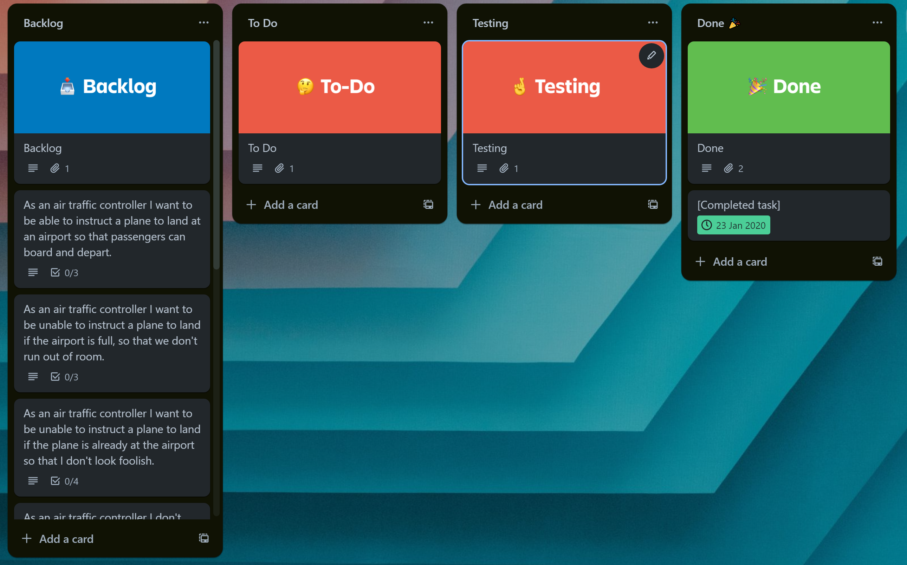
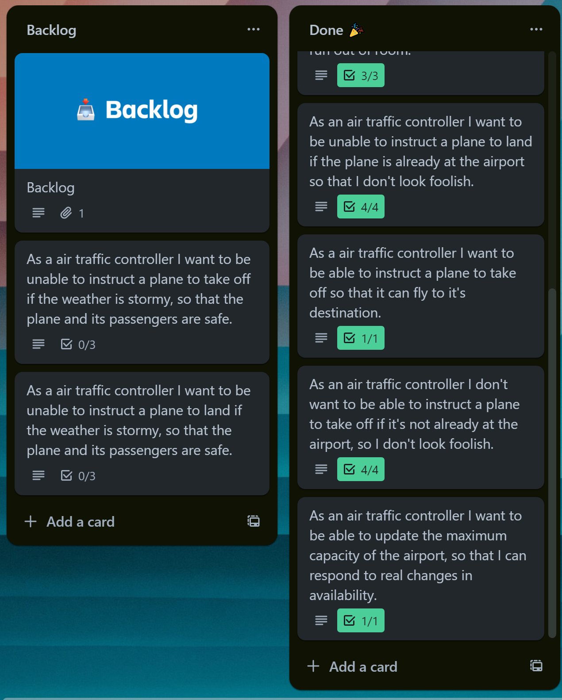

# Domain Models and Test Plan

User Stories and Domain Models

As an air traffic controller I want to be able to instruct a plane to land at an airport so that passengers can board and depart.

| Objects | Properties                   | Messages          | Output |
|---------|------------------------------|-------------------|--------|
| Airport | landedPlanes @Array[@Planes] | landPlane(@Plane) | @Void  |
| Plane   | id @String                   |                   |        |

As an air traffic controller I want to be unable to instruct a plane to land if the airport is full, so that we don't run out of room.

| Objects | Properties                   | Messages        | Output   |
|---------|------------------------------|-----------------|----------|
| Airport | landedPlanes @Array[@Planes] | isAirportFull() | @Boolean |
|         | airportCapacity @Integer     |                 |          |

As an air traffic controller I want to be unable to instruct a plane to land if the plane is already at the airport so that I don't look foolish.

| Objects | Properties                   | Messages | Output   |
|---------|------------------------------|----------|----------|
| Airport | landedPlanes @Array[@Planes] |          |          |
| Plane   | id @String                   | getId()  | @String  |

As a air traffic controller I want to be able to instruct a plane to take off so that it can fly to it's destination.

| Objects | Properties                   | Messages          | Output |
|---------|------------------------------|-------------------|--------|
| Airport | landedPlanes @Array[@Planes] | takeOff(@Plane)   | @Void  |
| Plane   | id @String                   |                   |        |

As an air traffic controller I don't want to be able to instruct a plane to take off if it's not already at the airport, so I don't look foolish.

| Objects | Properties                   | Messages  | Output   |
|---------|------------------------------|-----------|----------|
| Airport | landedPlanes @Array[@Planes] |           | @Boolean |
| Plane   | id @String                   | getId()   | @String  |

As an air traffic controller I want to be able to update the maximum capacity of the airport, so that I can respond to real changes in availability.

| Objects | Properties               | Messages                 | Output |
|---------|--------------------------|--------------------------|--------|
| Airport | airportCapacity @Integer | updateCapacity(@Integer) | @Void  |

As a air traffic controller I want to be unable to instruct a plane to land if the weather is stormy, so that the plane and its passengers are safe.

| Objects | Properties             | Messages                 | Output   |
|---------|------------------------|--------------------------|----------|
| Airport | stormyWeather @Boolean | checkIfWeatherIsStormy() | @Boolean |

As a air traffic controller I want to be unable to instruct a plane to take off if the weather is stormy so that the plane and its passengers are safe.

| Objects | Properties             | Messages                 | Output   |
|---------|------------------------|--------------------------|----------|
| Airport | stormyWeather @Boolean | checkIfWeatherIsStormy() | @Boolean |

